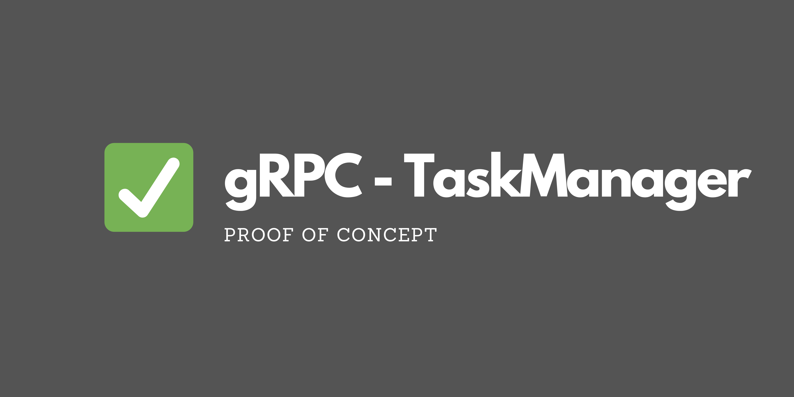

# 🛠 gRPC Task Manager




## 📌 Project Overview

**gRPC Task Manager** is a Proof of Concept (PoC) for a microservice handling **task management** using **NestJS** and **gRPC**.  
This service exposes a gRPC API that allows clients to **create, retrieve, update, delete, and list tasks**.  

The project is **fully backend-based**, without any frontend integration.  
All API communication happens through **gRPC**.

## 🚀 Features
- 📝 **Create, update, delete tasks** via gRPC  
- 📜 **List all tasks with server streaming**  
- ⚡ **Fast and efficient** communication with gRPC  
- ✅ **Uses Protocol Buffers (Protobuf)** for defining services  
- 📦 **Dependency management with pnpm**  

## 🏗️ Technologies Used
- **NestJS** 🚀 (Microservices + gRPC)  
- **TypeScript** 🟦 (Strict typing, modern JavaScript)  
- **gRPC** 📡 (Remote Procedure Call communication)  
- **Protocol Buffers** 🔗 (Efficient message serialization)  
- **pnpm** 📦 (Fast package management)  

## 🔧 Installation & Setup
Make sure you have **Node.js 18+** installed.  

### 1 Clone the repository
```sh
git clone https://github.com/BxptisteM/gRPC-TaskManager.git
cd gRPC-TaskManager
```

### 2 Install dependenciees 
```sh
cd back
pnpm install
```

### 3 Start the gRPC server (be sure to be in the /back directory)

```sh
pnpm start
```

## 🛠 API Definition

[See the proto file](/back/src/proto/task.proto)

## 👨‍💻 Author
[Baptiste Moreau](https://github.com/BxptisteM)
